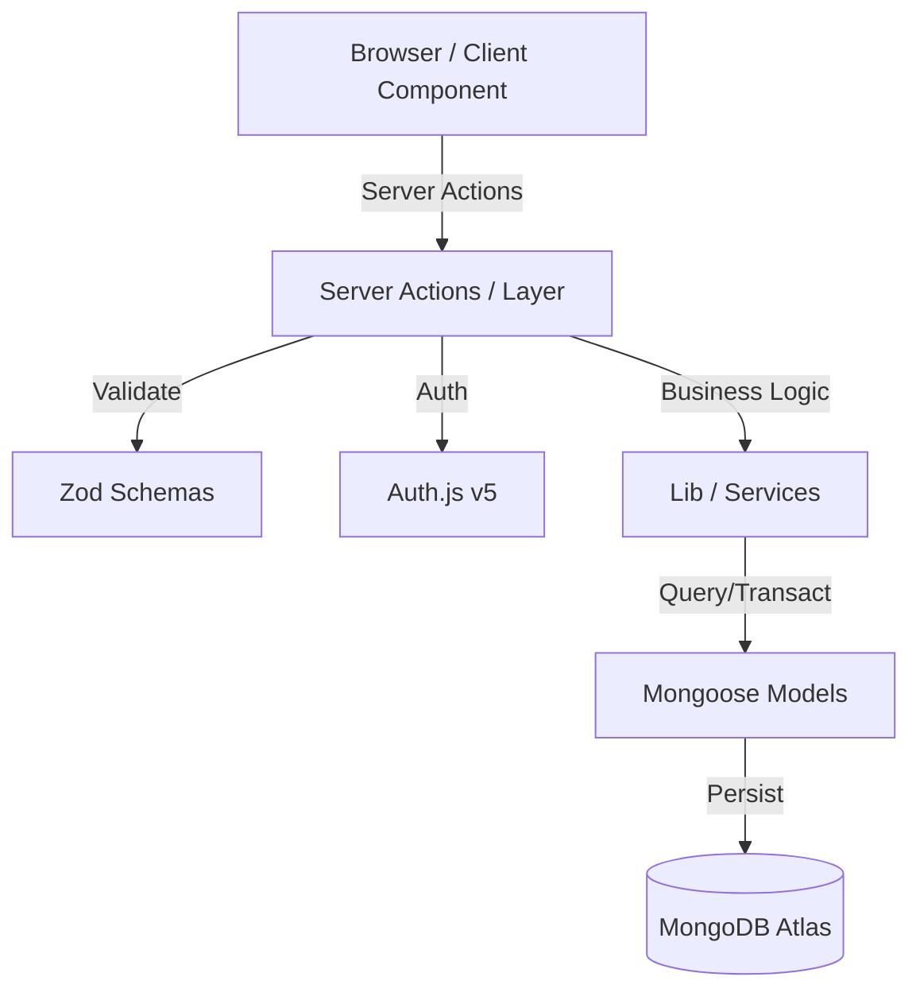
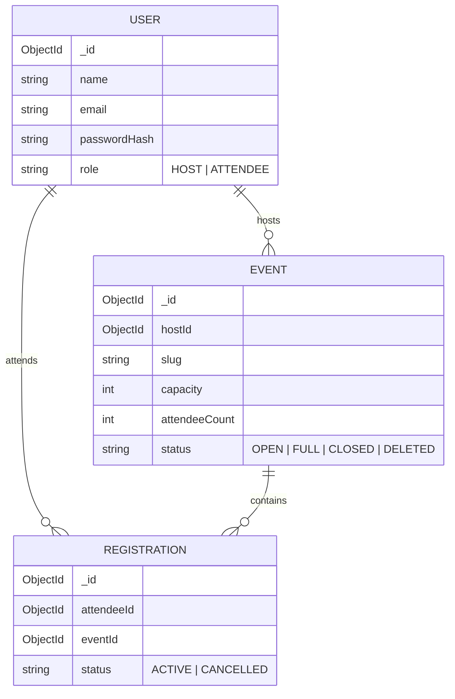

# evenregman

A robust Event Registration Management system built with Next.js 15, designed to facilitate event creation for hosts and seamless registration for attendees.

## System Architecture

The application follows a modern Next.js 15 App Router architecture, leveraging Server Actions for all data mutations and Mongoose for structured data persistence.



### Key Architectural Patterns
- **Atomic Operations**: Registration logic uses MongoDB transactions to prevent overbooking.
- **Layered Validation**: Form-level validation (Client) -> Schema validation (Action) -> Semantic validation (Business Logic) -> Model constraints (Database).
- **Route Groups**: Logical separation of `(host)` and `(public)` concerns without affecting the URL structure.

## Project Description

`evenregman` is a full-stack web application that streamlines the lifecycle of event management.

*   **Users**: The system supports two primary roles: **Hosts** (organizers) and **Attendees** (participants).
*   **Main Business Flow**: Hosts create events with specific capacities and registration cutoffs. Attendees visit public event pages to register. The system handles account creation or reuse automatically during the registration process.
*   **Core Functionality**: Atomic registrations using MongoDB transactions, role-based access control, unique slug generation for SEO-friendly URLs, and real-time capacity management.

## Business Rules

### 1. Registration Constraints
- **Cutoff Date**: Users cannot register for an event if the current system time is past the `registrationCutoff`.
- **Capacity**: Registrations are blocked once `attendeeCount >= capacity`.
- **Unique Registration**: A user (identified by email) can only have one active registration per event.
- **Status Dependency**: Only events with the status `OPEN` accept registrations.

### 2. Event Lifecycle
- **Slug Generation**: Slugs are derived from titles. If a collision occurs, the system attempts up to 25 variations before failing.
- **Automatic Full Status**: When the final seat is taken, the event status automatically transitions from `OPEN` to `FULL`.
- **Soft Deletion**: The `DELETED` status hides events from public views and host listings while maintaining data integrity for reporting.

### 3. Account Management
- **Unified Registration**: If an attendee registers with a new email, a `User` record is created. If the email exists, the system validates the password and reuses the account.
- **Role Isolation**: A user with a `HOST` role cannot register for events as an `ATTENDEE` using the same account.

## User Flows

### Host Flow
1. **Sign In**: Host authenticates via Credentials.
2. **Dashboard**: View high-level metrics (Active vs. Closed events).
3. **Event Creation**: Input event metadata. The system generates a unique slug.
4. **Management**: Edit event details or toggle status (Open/Close/Delete).

### Attendee Flow
1. **Discovery**: Access public URL `/events/[slug]`.
2. **Registration**: Fill in Name, Email, and Password.
3. **Atomic Processing**: System checks capacity -> creates/verifies user -> increments count -> saves registration (all within one transaction).

## Database Relationship Diagram



## Features

### Host Features
*   **Event Lifecycle Management**: Create, edit, close, reopen, and soft-delete events.
*   **Dashboard**: Overview of total events, active/closed status, and total registration metrics.
*   **Registration Tracking**: View and filter lists of attendees for specific events with search and sorting capabilities.
*   **Ownership Security**: Strict validation ensuring hosts can only manage their own events.

### Attendee Features
*   **Public Event Discovery**: View event details including date, time, location, and remaining seats.
*   **Integrated Registration**: Register for events via a unified form that creates a new attendee account or logs into an existing one.
*   **Seat Reservation**: Real-time validation to prevent overbooking and registrations past the cutoff date.

### Shared Features
*   **Authentication**: Secure login and session management for both roles.
*   **Responsive Design**: Modern UI built with Tailwind CSS and Radix UI components.

## Tech Stack

| Category | Technology |
| :--- | :--- |
| Framework | Next.js 15 (App Router) |
| Language | TypeScript |
| Database | MongoDB via Mongoose |
| Authentication | NextAuth.js (Auth.js v5) |
| Styling | Tailwind CSS 4.0 |
| UI Libraries | Radix UI, Lucide React, Framer Motion |
| Validation | Zod |
| Utilities | bcryptjs (Hashing), clsx, tailwind-merge |
| Deployment | Optimized for Vercel & MongoDB Atlas |

## Architecture Overview

*   **Application Structure**: Follows Next.js App Router patterns with grouped routes for `(host)` and `(public)` contexts.
*   **Authentication Flow**: Handled by NextAuth.js using a Credentials provider. Users are assigned roles (`HOST` or `ATTENDEE`) upon creation.
*   **Registration Flow**: Uses MongoDB sessions and transactions in `registerAttendeeForEvent` to ensure that seat increments and registration records are atomic, preventing "oversold" events during high concurrency.
*   **Event Management**: Implemented via Server Actions for high performance and reduced client-side shipping.
*   **Authorization Flow**: 
    1. Middleware/Auth check for session existence.
    2. Role check via `canAccessHostRoute`.
    3. Resource ownership check via `assertEventOwnership(eventId, hostId)`.

## Folder Structure

```text
evenregman/
├── src/
│   ├── app/                    
│   │   ├── (host)/             # Layouts and pages restricted to Host role
│   │   ├── (public)/           # Publicly accessible routes (Landing, Detail)
│   │   └── api/auth/           # Auth.js configuration and callback handlers
│   ├── components/             
│   │   ├── dashboard/          # Specialized host-view components (EventTable, stats)
│   │   └── ui/                 # Atomic shadcn-like UI components
│   ├── lib/                    
│   │   ├── db.ts               # MongoDB connection pooling logic
│   │   ├── ownership.ts        # Server-side resource authorization utilities
│   │   └── registrations.ts    # Transactional registration business service
│   ├── models/                 # Mongoose schema definitions
│   └── schemas/                # Zod definitions shared between client and server
├── public/                     # Static assets
└── package.json                # Project configuration and dependencies
```

## Database Design

### Models
1.  **User**
    *   Fields: `name`, `email` (unique), `passwordHash`, `role` (HOST/ATTENDEE).
    *   Constraints: Strict email regex validation and bcrypt hash length requirements.
2.  **Event**
    *   Fields: `hostId` (Ref), `title`, `slug` (unique), `capacity`, `attendeeCount`, `registrationCutoff`, `status`.
    *   Indexes: Unique index on `slug`.
3.  **Registration**
    *   Fields: `attendeeId` (Ref), `eventId` (Ref), `status` (ACTIVE/CANCELLED).
    *   Relationships: Links Users (Attendees) to Events.

## Authentication & Authorization

*   **Login Flow**: Handled via `next-auth`. Session stores the user `id` and `role`.
*   **Role Protection**: Routes under `(host)` are guarded by role checks (e.g., `canAccessHostRoute`).
*   **Ownership Validation**: The `assertEventOwnership` utility verifies that the `hostId` of an event matches the authenticated session user before allowing updates.

## Environment Variables

Create a `.env.local` file in the root directory.

### .env.local Example
```env
MONGODB_URI=mongodb+srv://<user>:<password>@cluster.mongodb.net/evenregman
AUTH_SECRET=your_next_auth_secret_here
AUTH_URL=http://localhost:3000
```

*   **MONGODB_URI**: Required. Connection string for your MongoDB instance.
*   **AUTH_SECRET**: Required. A random string used to hash tokens.
*   **AUTH_URL**: Required for local development (NextAuth).

## Installation

1.  **Clone the repository**:
    ```bash
    git clone <repository-url>
    cd evenregman
    ```
2.  **Install dependencies**:
    ```bash
    npm install
    ```
3.  **Configure environment variables**:
    Create `.env.local` as described in the section above.

## Running Locally

*   **Development Server**:
    ```bash
    npm run dev
    ```
*   **Production Build**:
    ```bash
    npm run build
    npm run start
    ```
*   **Type Checking**:
    ```bash
    npm run typecheck
    ```

## Available Routes

| Route | Access Level | Description |
| :--- | :--- | :--- |
| `/` | Public | Homepage / Landing (assumed). |
| `/events/[slug]` | Public | Public event details and registration form. |
| `/host/dashboard` | Host | Overview of events and registration stats. |
| `/host/events/new` | Host | Form to create a new event. |
| `/host/events/[id]/edit` | Host | Manage specific event details and status. |

## API Documentation

The project primarily uses **Next.js Server Actions** for data mutations:
*   `createEventAction`: Validates and saves new events.
*   `updateEventAction`: Updates existing event data with ownership checks.
*   `registerAttendeeForEvent`: Atomic registration logic including account handling.
*   `updateEventStatus`: Handles status transitions (Open, Close, Delete).

## Security Considerations

*   **Password Hashing**: Uses `bcryptjs` with a salt cost of 12.
*   **Slug Collisions**: `generateUniqueEventSlug` implements an iterative check (up to 25 attempts) to prevent duplicate URL paths.
*   **Transaction Integrity**: Registrations use `session.withTransaction()` to ensure `attendeeCount` in the `Event` model stays in sync with `Registration` records.
*   **Server-Only Logic**: Sensitive business logic and DB calls are marked with `"server-only"` to prevent client-side leakage.

## Deployment Guide

### Vercel
1.  Connect your GitHub repository to Vercel.
2.  Add the environment variables (`MONGODB_URI`, `AUTH_SECRET`) in the Vercel Project Settings.
3.  Vercel will automatically detect Next.js and deploy.

### MongoDB Atlas
1.  Create a new Cluster.
2.  Whitelist the deployment IP (or 0.0.0.0/0 for Vercel).
3.  Copy the connection string into `MONGODB_URI`.

## Troubleshooting

*   **Database Connection**: Ensure your IP is whitelisted in MongoDB Atlas if you encounter connection timeouts.
*   **Auth Session**: If login fails, verify `AUTH_SECRET` is consistent across your environment.
*   **Slug Generation**: If you receive a "Could not generate unique slug" error, try using more specific keywords in the event title.

## Future Improvements

*   **Email Notifications**: Send confirmation emails upon successful registration.
*   **Export Data**: Add CSV/Excel export for registration lists.
*   **Waitlist**: Implement a waitlist feature for events that are "FULL".
