# Evenregman - Architecture Diagrams & Visual Reference

Complete visual representation of the Evenregman system using Mermaid diagrams.

---

## 1. System Context Diagram

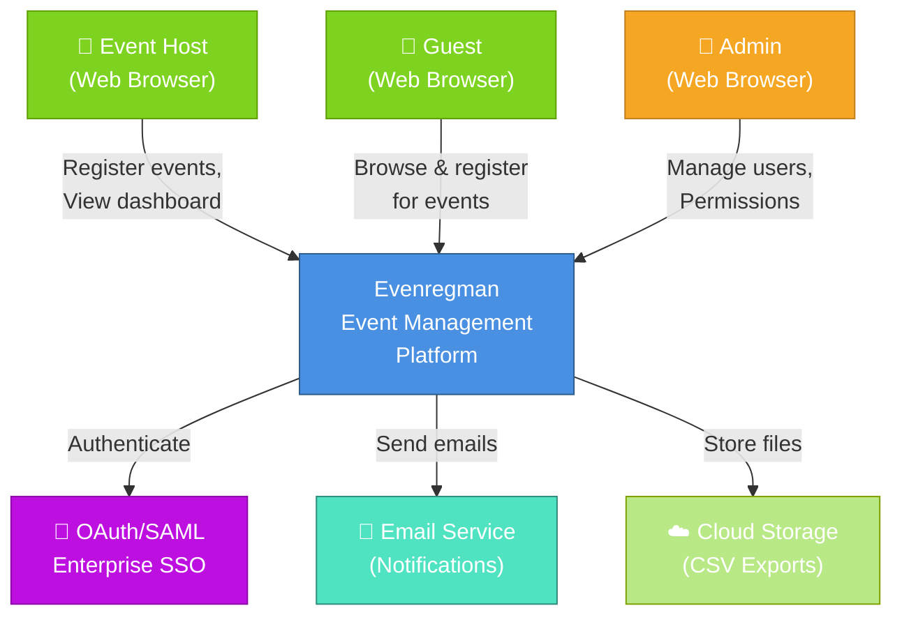

### How to Read This Diagram

This is the highest-level view of the system. It shows:
- **Who** uses the system (hosts, guests, admins)
- **What** they do with it (register, manage, view)
- **Where** data flows externally (OAuth, email, storage)

The arrows show information flowing between actors and the system.

### Important Observations

1. **Three types of users**: System must handle different roles/permissions
2. **External dependencies**: System relies on OAuth (authentication), Email (communication), Storage (exports)
3. **Single application**: All users access the same Evenregman system
4. **Bi-directional communication**: System both receives input and sends output

### Questions to Test Your Understanding

1. Why does the system need external OAuth instead of managing auth internally?
2. What would happen if the email service goes down?
3. Why is cloud storage needed separately from the database?
4. How does the system know if a user is a host vs guest vs admin?
5. Can a single person have multiple roles simultaneously?

---

## 2. Container Diagram

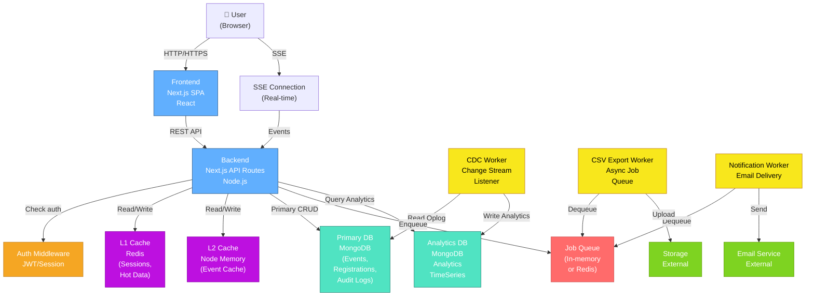

### How to Read This Diagram

Containers are the major deployable units:
- **Frontend**: What users see (React app)
- **Backend**: Where logic runs (API)
- **Databases**: Where data lives (MongoDB primary + analytics)
- **Workers**: Async processing (CDC, CSV, notifications)
- **Caches**: Performance layer (Redis + memory)

Lines show data/communication flowing between containers.

### Important Observations

1. **Two databases**: Primary MongoDB for operational data, separate for analytics (CDC pattern)
2. **Two caches**: Redis (L1, persistent) + Memory (L2, local) for performance
3. **Multiple workers**: Decoupled from main API (CDC, CSV export, notifications)
4. **Queue in middle**: Decouples requests from long-running jobs
5. **External services**: Email and storage are outside, reducing dependencies

### Questions to Test Your Understanding

1. Why have two separate databases (primary + analytics)?
2. What happens if the Redis cache goes down?
3. Why run CSV export as a separate worker instead of in the API?
4. How does the frontend know when a CSV export completes?
5. What data goes into L1 cache vs L2 cache?
6. Why use Server-Sent Events instead of just polling?

---

## 3. Component Diagram - Core Application

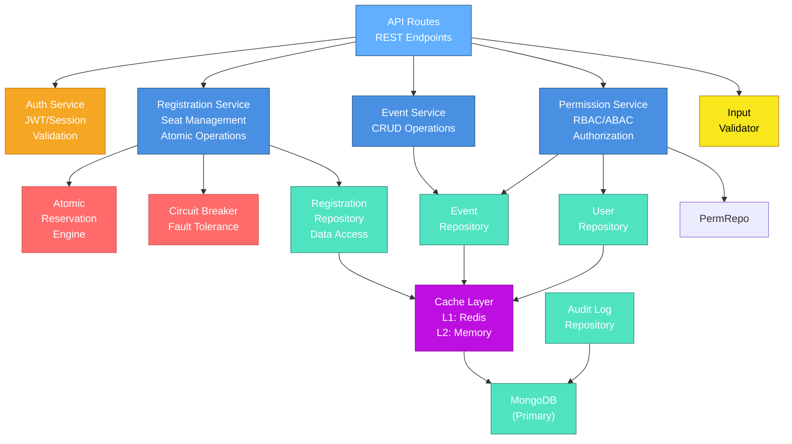

### How to Read This Diagram

Components are logical groupings within the backend:
- **Service layer**: Business logic (Registration, Event, Permission services)
- **Repository layer**: Data access (hiding database details)
- **Cross-cutting concerns**: Auth, validation, caching, circuit breaker
- **Persistence**: Database as the foundation

### Important Observations

1. **Layered architecture**: API → Services → Repositories → Database
2. **Cross-cutting concerns**: Auth and validation applied to all API routes
3. **Atomic operations**: Special handling for reservations (atomic engine)
4. **Fault tolerance**: Circuit breaker for external/risky operations
5. **Cache before DB**: All data access goes through cache first
6. **Repository pattern**: Data access abstracted from business logic

### Questions to Test Your Understanding

1. Why have a separate PermService instead of checking permissions in each service?
2. What does the Repository pattern buy us?
3. When would the CircuitBreaker trigger?
4. How does the Validator prevent bad data from entering?
5. Why separate atomic reservation logic into its own component?

---

## 4. Dependency Diagram

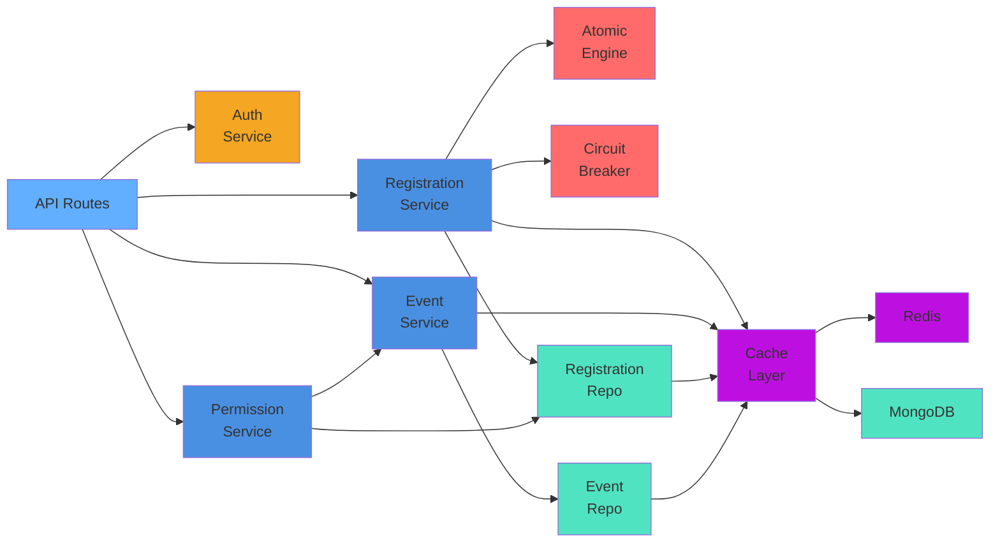

### How to Read This Diagram

Arrows show "depends on" relationships:
- Registration Service depends on Atomic Engine, Cache, etc.
- Everything eventually depends on database

This shows coupling and what changes if one component changes.

### Important Observations

1. **Fan-in to cache**: All data access goes through cache (centralized)
2. **Fan-in to DB**: Single source of truth
3. **Services relatively isolated**: Limited dependencies between them
4. **Cache is critical dependency**: Remove it and everything slows down

### Questions to Test Your Understanding

1. If you change the Cache implementation, what needs updating?
2. What happens if PermService depends on RegService and vice versa (circular)?
3. Which components could be tested in isolation?
4. If you wanted to switch databases, what would need changing?

---

## 5. Registration Request Lifecycle

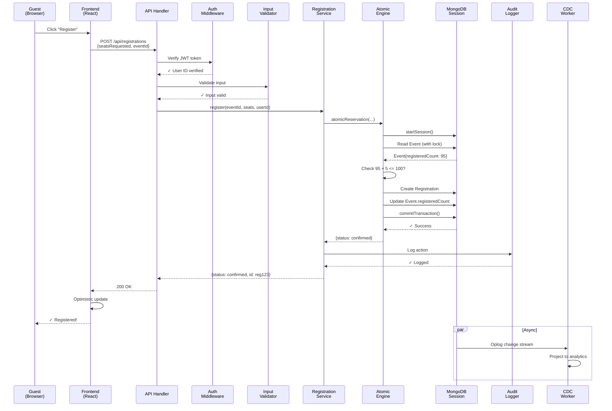

### How to Read This Diagram

This shows the complete journey of a registration request:
1. **Client sends request** with seat count
2. **Auth verified** (is this user authenticated?)
3. **Input validated** (is data valid?)
4. **Service called** (business logic)
5. **Atomic transaction** (ensure no overbooking)
6. **Audit logged** (record what happened)
7. **Response sent** (client sees result)
8. **CDC updates analytics** (in background)

### Important Observations

1. **Authentication first**: Happens before any validation or business logic
2. **Atomic operation**: Lock acquired, capacity checked, writes happen together
3. **Audit logging**: Every action recorded (for compliance)
4. **Async CDC**: Analytics updated after response sent (doesn't block user)
5. **Optimistic update**: Frontend updates immediately (doesn't wait for response)

### Questions to Test Your Understanding

1. What happens if auth fails? (Diagram shows success path)
2. Why does the atomic engine need to lock the Event document?
3. What if 5 guests hit register simultaneously for the last 3 seats?
4. Why log to audit log if the transaction already records what happened?
5. What if CDC worker crashes mid-way through projection?

---

## 6. Data Flow Diagram

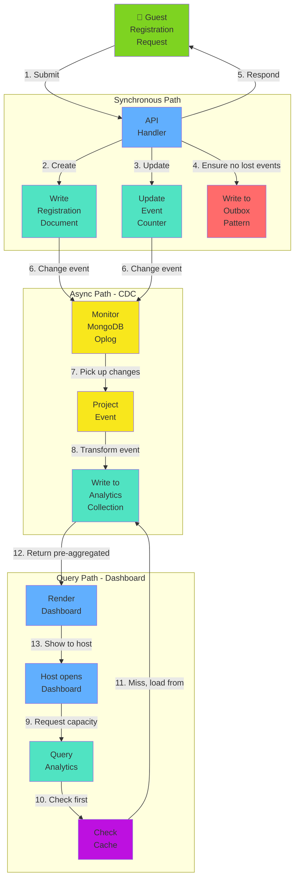

### How to Read This Diagram

Numbers show the sequence of data movements:
1. **Guest registers** → API processes synchronously
2. **Data persisted** → Written to database
3. **Outbox ensures safety** → CDC has record of change
4. **CDC worker picks up** → Detects change in oplog
5. **Projects to analytics** → Transforms into query-friendly format
6. **Host queries** → Asks for capacity metrics
7. **Cache checked first** → Fast path
8. **If miss, load from analytics** → Pre-aggregated data is fast

### Important Observations

1. **Two-path design**: Sync for confirmation, async for analytics
2. **Outbox pattern**: Guarantees no lost events between sync and async
3. **Pre-aggregation**: Dashboard doesn't calculate, just queries
4. **Cache layer**: Prevents repeated queries to analytics collection
5. **No blocking**: User gets immediate confirmation, analytics update in background

### Questions to Test Your Understanding

1. Why need Outbox pattern if CDC watches oplog anyway?
2. What's the latency from registration → analytics update? (Unknown - depends on worker polling)
3. Why not query primary registration table for dashboard?
4. What if analytics collection has stale data while CDC is processing?
5. How does cache invalidation work (when does cache refresh)?

---

## 7. Authentication & Authorization Flow

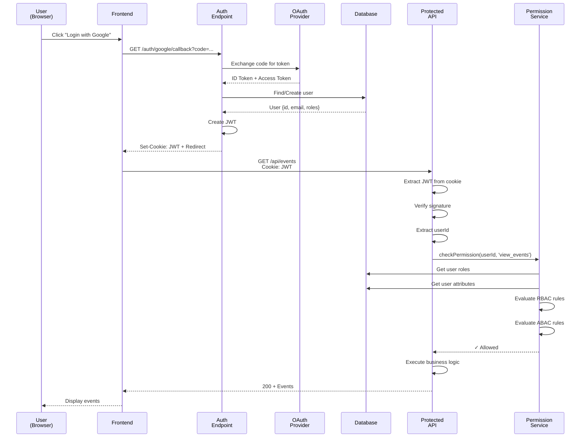

### How to Read This Diagram

Three phases:
1. **Authentication (Who am I?)**: OAuth login → JWT token created
2. **Authorization (Can I do this?)**: RBAC + ABAC rules evaluated
3. **Resource access**: If allowed, return data

### Important Observations

1. **OAuth for login**: Delegates to external provider (Google, etc)
2. **JWT for subsequent requests**: Stateless, cookie-based
3. **Permission check per request**: Not just at login time
4. **Two types of checks**: RBAC (role-based) + ABAC (attribute-based)
5. **Database lookups**: Roles and attributes come from DB

### Questions to Test Your Understanding

1. Why use OAuth instead of username/password?
2. Why JWT instead of session-based (server-side stored tokens)?
3. What if a user's role changes mid-session?
4. How does ABAC differ from RBAC?
5. Why check permissions on every request instead of just at login?
6. What if the user deletes their Google account?

---

## 8. Database Entity-Relationship Diagram

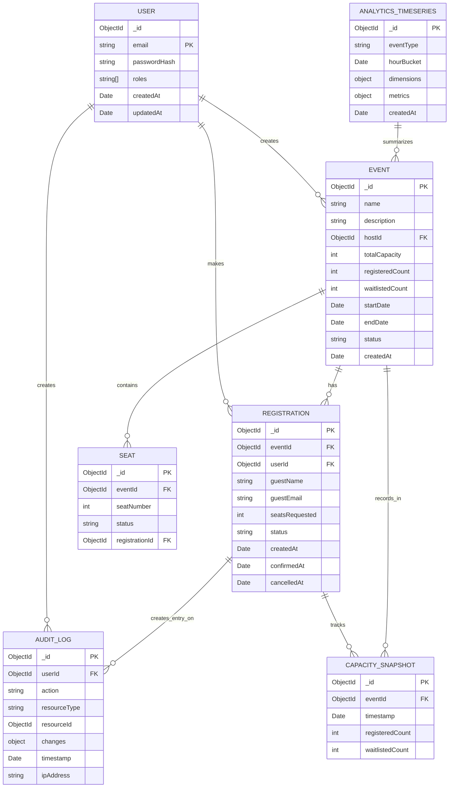

### How to Read This Diagram

- **Boxes** represent tables/collections
- **Lines** show relationships (one-to-many, etc)
- **Inside boxes**: Important fields with types
- **PK**: Primary key (unique identifier)
- **FK**: Foreign key (reference to another table)

### Important Observations

1. **Denormalized counters**: Event has registeredCount + waitlistedCount (not calculated from registrations)
2. **Audit log is append-only**: Records every action, never updated
3. **SEAT table**: Explicit seat allocation (can query "which seat is booked")
4. **ANALYTICS_TIMESERIES**: Pre-aggregated (separate from operational data)
5. **CAPACITY_SNAPSHOT**: History of capacity changes (for trending)
6. **No direct SEAT.user**: Seats reference registrations, not users

### Questions to Test Your Understanding

1. Why denormalize registeredCount instead of always calculating it?
2. Why have separate ANALYTICS_TIMESERIES instead of querying registrations?
3. What's the difference between REGISTRATION and SEAT tables?
4. How would you query "all guests at event X"?
5. How would you query "all events user Y attended"?
6. If a registration is cancelled, does its seat entry get deleted?

---

## 9. Sequence Diagrams - Five Core Operations

### 9A. Guest Registration for Event

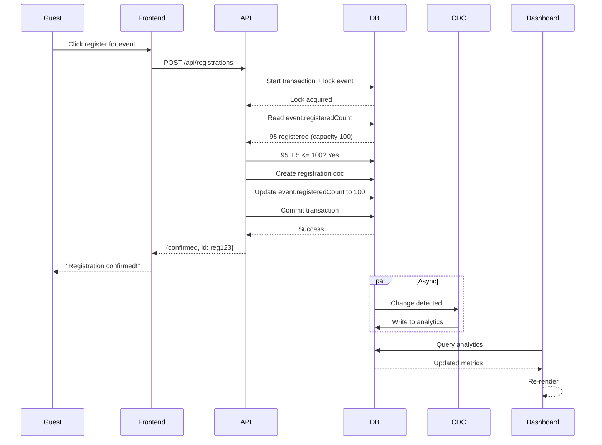

### 9B. Host Views Real-Time Dashboard

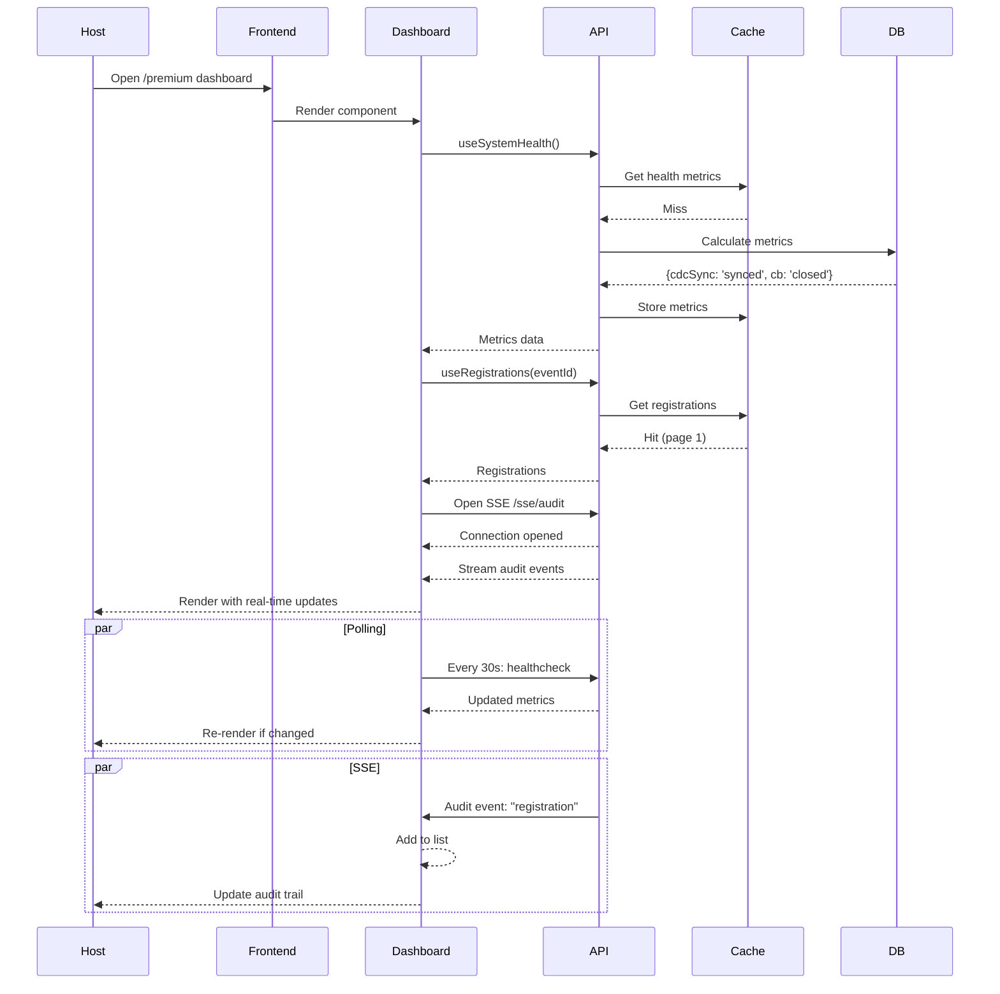

### 9C. Host Cancels a Registration

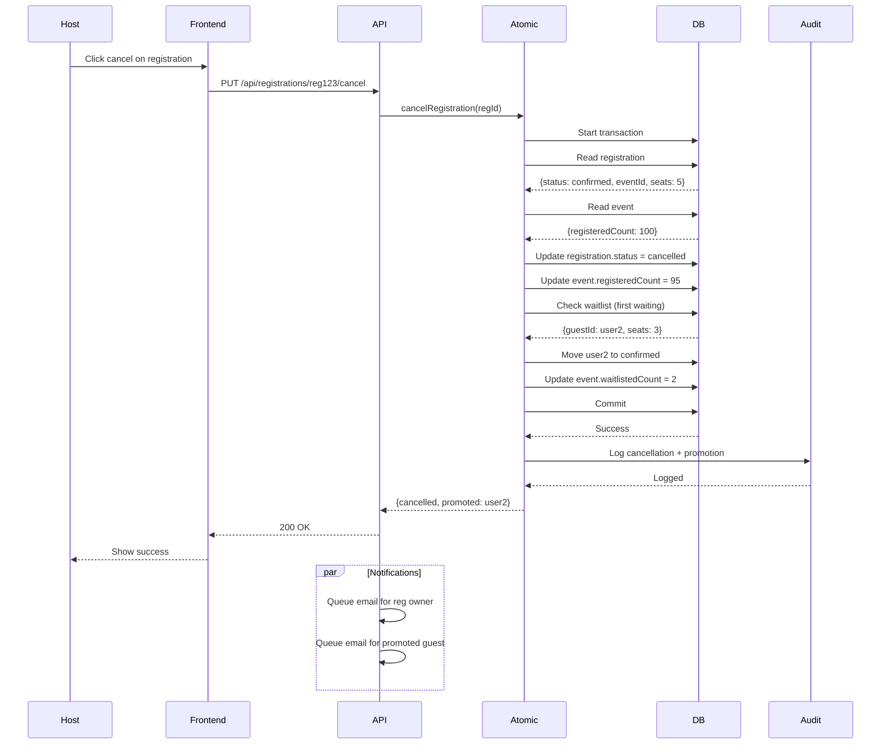

### 9D. CSV Export Initiated

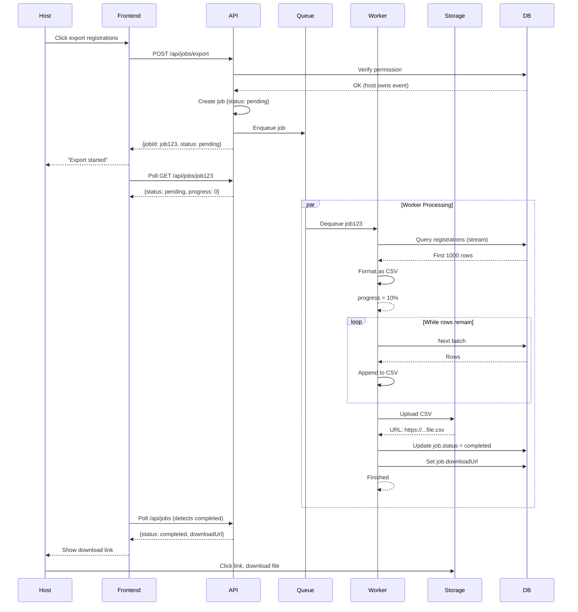

### 9E. CDC Pipeline Processing

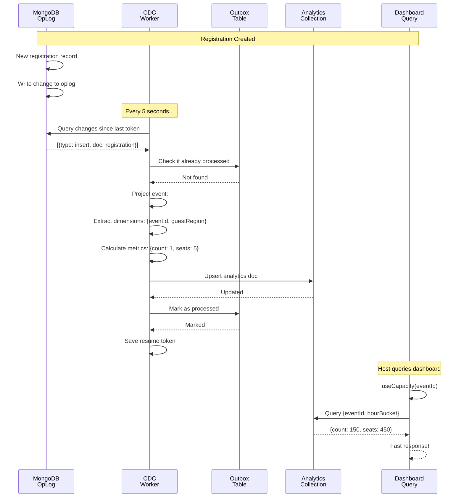

---

## 10. Deployment Architecture

```mermaid
graph TB
    subgraph "Client Layer"
        Browser["🌐 User Browser<br/>Next.js SPA<br/>(React)"]
        Mobile["📱 Mobile Browser<br/>Responsive App"]
    end
    
    subgraph "CDN"
        CDN["☁️ CDN<br/>Static Assets<br/>JS, CSS, Images"]
    end
    
    subgraph "Application Servers"
        LB["⚙️ Load Balancer<br/>HTTP/HTTPS"]
        Server1["Node.js Server 1<br/>Next.js<br/>API Routes"]
        Server2["Node.js Server 2<br/>Next.js<br/>API Routes"]
        Server3["Node.js Server 3<br/>Next.js<br/>API Routes"]
    end
    
    subgraph "Cache Layer"
        Redis["🔴 Redis Cluster<br/>L1 Cache<br/>Sessions"]
    end
    
    subgraph "Worker Nodes"
        CDC["CDC Worker<br/>Change Streams"]
        CSV["CSV Worker<br/>Exports"]
        Notify["Notification Worker<br/>Email"]
    end
    
    subgraph "Data Layer"
        PrimaryDB["📊 MongoDB Primary<br/>Events, Registrations<br/>Users, Audit"]
        ReplicaDB["📊 MongoDB Replica<br/>Read-Only<br/>Analytics queries"]
        AnalyticsDB["📊 Analytics MongoDB<br/>Pre-aggregated<br/>Dashboard queries"]
    end
    
    subgraph "External Services"
        OAuth["🔐 OAuth Provider<br/>Google/Okta/etc"]
        Email["📧 Email Service<br/>SendGrid/SES"]
        Storage["☁️ Cloud Storage<br/>S3/GCS<br/>CSV Files"]
    end
    
    subgraph "Monitoring & Logging"
        Logs["📝 Logging<br/>CloudWatch/ELK"]
        Metrics["📈 Metrics<br/>Prometheus/Datadog"]
        Alerts["🔔 Alerts<br/>PagerDuty"]
    end
    
    Browser -->|HTTPS| CDN
    Browser -->|HTTPS| LB
    Mobile -->|HTTPS| CDN
    Mobile -->|HTTPS| LB
    
    LB -->|Round Robin| Server1
    LB -->|Round Robin| Server2
    LB -->|Round Robin| Server3
    
    Server1 -->|Read/Write| Redis
    Server2 -->|Read/Write| Redis
    Server3 -->|Read/Write| Redis
    
    Server1 -->|Query/Insert| PrimaryDB
    Server2 -->|Query/Insert| PrimaryDB
    Server3 -->|Query/Insert| PrimaryDB
    
    PrimaryDB -->|Replication| ReplicaDB
    PrimaryDB -->|Oplog| CDC
    
    CDC -->|Write| AnalyticsDB
    CSV -->|Read| PrimaryDB
    Notify -->|Read| PrimaryDB
    
    Server1 -->|Queue jobs| CDC
    Server1 -->|Queue jobs| CSV
    Server1 -->|Queue jobs| Notify
    
    ReplicaDB -->|Read| Server1
    ReplicaDB -->|Read| Server2
    ReplicaDB -->|Read| Server3
    
    Server1 -->|Query| AnalyticsDB
    Server2 -->|Query| AnalyticsDB
    Server3 -->|Query| AnalyticsDB
    
    Server1 -->|OAuth| OAuth
    Server2 -->|OAuth| OAuth
    Server3 -->|OAuth| OAuth
    
    Notify -->|Send| Email
    CSV -->|Upload| Storage
    
    Server1 -->|Ship| Logs
    Server2 -->|Ship| Logs
    Server3 -->|Ship| Logs
    CDC -->|Ship| Logs
    
    Server1 -->|Emit| Metrics
    Redis -->|Emit| Metrics
    PrimaryDB -->|Emit| Metrics
    
    Metrics -->|Trigger| Alerts
    Logs -->|Alert on errors| Alerts
    
    style Browser fill:#61AFFE
    style Mobile fill:#61AFFE
    style CDN fill:#7ED321
    style LB fill:#F5A623
    style Server1 fill:#4A90E2
    style Server2 fill:#4A90E2
    style Server3 fill:#4A90E2
    style Redis fill:#BD10E0
    style CDC fill:#F8E71C
    style CSV fill:#F8E71C
    style Notify fill:#F8E71C
    style PrimaryDB fill:#50E3C2
    style ReplicaDB fill:#50E3C2
    style AnalyticsDB fill:#50E3C2
    style OAuth fill:#FF6B6B
    style Email fill:#7ED321
    style Storage fill:#7ED321
    style Logs fill:#9B9B9B
    style Metrics fill:#9B9B9B
    style Alerts fill:#FF6B6B
```

### How to Read This Diagram

Layers show separation of concerns:
1. **Client layer**: Where users access from
2. **CDN**: Fast delivery of static files
3. **Application layer**: Where logic runs (horizontally scaled)
4. **Cache layer**: Shared Redis (survives app restarts)
5. **Worker nodes**: Async processing
6. **Data layer**: MongoDB (primary + replicas)
7. **External services**: Outside our control
8. **Monitoring**: Observe system health

### Important Observations

1. **Horizontal scaling**: Multiple app servers behind load balancer
2. **Shared cache**: Redis cluster used by all servers (not in-process)
3. **Replica database**: Read queries can go to replica (reduces load)
4. **Worker separation**: Long-running tasks don't block API
5. **Analytics separate**: Dedicated MongoDB for dashboard queries
6. **Monitoring built-in**: All components ship metrics/logs
7. **External dependencies**: OAuth, email, storage are not our problem

### Questions to Test Your Understanding

1. Why have both primary and replica databases?
2. What happens if a single app server crashes?
3. Why not store sessions in app memory (would lose on restart)?
4. How does the load balancer know which server to send to?
5. Why separate analytics MongoDB from primary database?
6. What happens if Redis crashes?
7. How many servers do you need based on traffic?
8. Where would rate limiting happen (which layer)?

---

## Summary: What These Diagrams Reveal

### Architecture Principles Demonstrated

1. **Layered separation**: API → Services → Repositories → Database
2. **Caching strategy**: Multiple layers (L1 Redis, L2 memory, query cache)
3. **Async processing**: Workers decoupled from main API
4. **Event-driven**: CDC pipeline for analytics
5. **Fault tolerance**: Circuit breaker, retries, graceful degradation
6. **Scalability**: Horizontal scaling of application servers
7. **Data consistency**: Atomic operations, audit logging
8. **Security**: Authentication (OAuth) + Authorization (RBAC/ABAC)

### Key Design Decisions Visible

| Decision | Why | Evidence |
|----------|-----|----------|
| CDC for analytics | Query-time aggregation would be slow | Separate analytics DB exists |
| Two caches | Redis for shared state, memory for local | Both present in architecture |
| Atomic transactions | Prevent overbooking | Atomic engine component exists |
| OAuth | Don't manage passwords | OAuth provider in diagrams |
| Workers separate | Long tasks shouldn't block API | Queue + workers in architecture |
| Audit logging | Compliance + debugging | Audit table in ER diagram |
| Denormalized counters | Fast capacity checks | registeredCount on Event |

---

## How to Use These Diagrams

### For Learning
- Read 1-10 in order to understand system depth
- Each diagram builds on previous understanding
- Questions test your comprehension

### For Design Decisions
- When adding a feature, which diagram changes?
- If you don't know which diagram to change, you don't understand the architecture

### For Communication
- Show context diagram to non-technical stakeholders
- Show container diagram to engineers
- Show sequence diagrams for complex flows

### For Onboarding
- Context + container = "this is what we build"
- Components + dependencies = "how it works internally"
- Sequences = "what happens when X"
- Deployment = "where it runs"

---

**Next Steps**: 
- Print these diagrams
- Draw them by hand (learning activity)
- Modify them if you find errors
- Use as reference when reading code

These diagrams should match the code. If they don't, either:
1. The code changed (update diagrams)
2. The diagrams were wrong (fix them)
3. Technical debt exists (fix the code)
